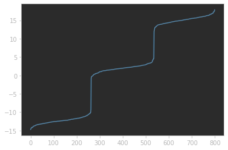

# Misc - Data Degeneration - 388pts

Description:

Generating data is ez but recovering is >< I lost the `mean` I used to generate it, can you find the most probable one for me? #bigdata #helpmepliz

## Problem statement
We are given a txt file with a list of numbers. We are also given a Python script used to generate these numbers.

chall.py:
```python
import numpy as np
import random as r
from math import sqrt
import time

r.seed(time.time())

def rand(start, end) -> float:
  return r.random() * (end - start) + start

count = 3
interval = [-30, 30]

means = [rand(*interval) for _ in range(count)]
variance = 1
std_dev = round(sqrt(variance))

def sample(mu, sigma):
    return np.random.normal(mu, sigma)

points = []
for _ in range(800):
    mean = means[r.randint(0, len(means)-1)]
    points.append(sample(mean, std_dev))

with open("data.txt", "w") as f:
    inter = list(map(str,interval))
    ps = list(map(str, points))

    f.write(", ".join(ps))
```

data.txt (first few numbers):
```
14.590720623953896, 13.304617884694125, -12.46088315693506, 16.289667599315155, -12.200764900343449, 0.3487516705903966, 0.3119365529880864, 16.085068714189497, 2.7489599201432666, 2.7757957599808485, 13.596380499683574, 16.490255564823975
```

By analyzing `chall.py`, we can came up with a few conclusions:
1. The numbers are generated from 3 different normal distributions.
2. Each distribution has a different mean that is also randomly generated and each generated mean is numerically relatively far from each other (e.g. the means differs by a large margin relative to the mean's actual value).

The problem for us to solve is obvious now: we need to find the 3 unknown means that were used to generate these numbers.

## Solving
To solve this challenge, we must first realise two properties of the distributions:

1. A property of a normal distribution is that the mean of a large enough sample of the distribution is close to the true mean of the distribution.
2. If the mean of the two normal distributions differs by a large margin, and variance is small like 1, then the numbers generated by these two distributions are highly likely to be numerically far from each other.

With these in mind, we can deduce that the numerical values of the 800 numbers must show a clear pattern of being numerically separated into 3 different range of values, since we have 3 distributions.

We can use `matplotlib` to plot the 800 numbers to verify the pattern. Before plotting, we need to sort the numbers either by ascending or descending order to clearly see the different range of values.

```python
from matplotlib import pyplot as plt
import numpy as np

with open('data.txt', 'r') as f:
    data = f.read().split(', ')  # read the numbers
data = [float(i) for i in data]  # convert to floats for plotting
data.sort()  # sort the numbers
plt.plot(data)  # plot the numbers
```
Running this code, we will get a graph that clearly shows the 3 range of values:



Now, our job is to find the boundaries of the 3 ranges of values. They are not evenly distributed as the sampling process is random, however based on the graph's x-axis, we can estimate the index of the boundaries and manually inspect the values in the list.

Let's take the first range of values as example. `data[262]` gave -9.249966911965059, but `data[263]` gave -0.7603410889792714. This means up to the 262nd number belongs to the first range.

Repeat this inspection for the boundary around 530-540 and you will get 535 as the last number for the 2nd range, and 536 as the first number for the 3rd range.

Now all that's left is to calculate the mean of each of these 3 range of numbers and submit for flag.

```python
print(np.mean(data[:263]))  # remember Python ending index is not inclusive, but starting index is.
print(np.mean(data[263:536]))
print(np.mean(data[536:]))
```
yields
```
-12.338427064508236
1.9577592884447568
15.138693435527589
```
and we can get the flag: `grey{3m_iS_bL4cK_mAg1C}`